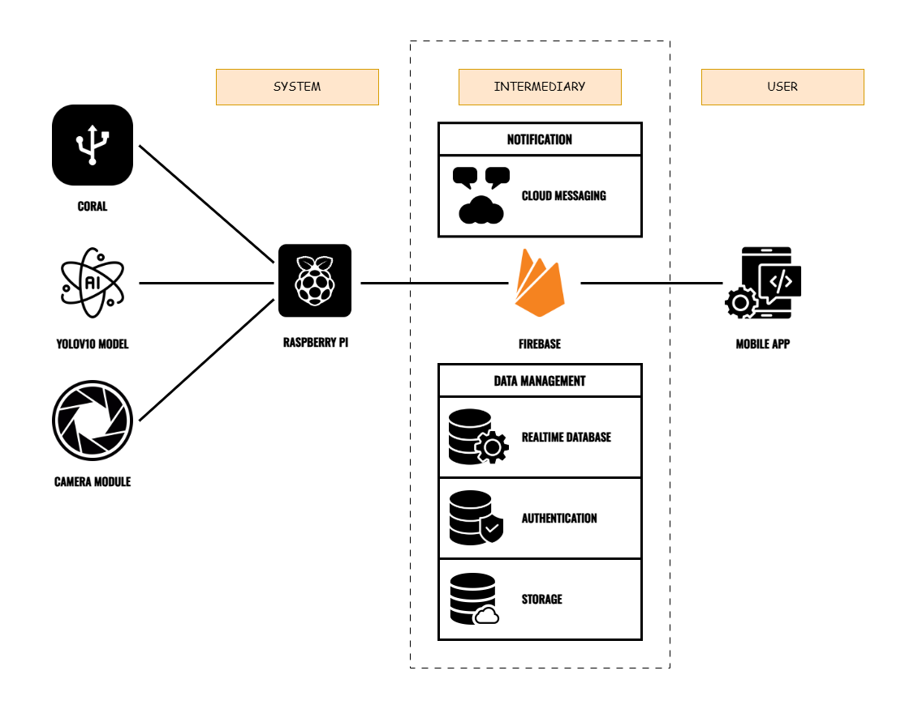

# FIRE DETECTION MOBILE APPLICATION

    <em>
        The real-time fire detection system, built upon the YOLOv10 deep learning model, is deployed on an embedded platform where the Raspberry Pi serves as the central processing unit, integrating the Camera Module for real-time image capture and the Coral USB Accelerator for accelerated model inference. This setup ensures rapid and efficient processing of incoming data, allowing the YOLOv10 model to analyze images and accurately detect fire-related signs such as flames or smoke. Upon detecting a sign, the Raspberry Pi sends events to Firebase for data storage and management, which includes Firebase Realtime Database for event recording, Firebase Authentication for user access control, and Firebase Storage for image storage and retrieval. Simultaneously, an instant notification is triggered and delivered to the user’s mobile application via Firebase Cloud Messaging service. Specifically, users can access event details, including captured images and timestamps, through the application interface for situational awareness. Consequently, this ensures that users receive critical alerts promptly, allowing them to make timely and well-informed decisions. Overall, the real-time fire detection system leverages advanced technologies, including YOLO, Firebase, Raspberry Pi, and Coral, to optimize fire detection and alerting efficiency. Furthermore, this approach guarantees the swift delivery of critical information to users, enhancing emergency situation management, reducing false alarms, and protecting vital areas through proactive monitoring and timely response actions.
    </em>

